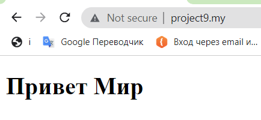

## Домашнее заданее № 9:

- Устанавливаем Laravel через OpenServer командой  composer create-project --prefer-dist laravel/laravel project9.my
- В Open Server в разделе "Домены" настроим новый домен для нашего нового проекта. Домашний каталог у Laravel (там где лежит файл index.php) находится в каталоге "public", и именно его мы должны указать в качестве папки домена.
- Теперь заходим в папку routes и находим файл web.php, меняем название стараницы для отображения по роутингу "/" корня сайта на test.
- В папке resources заходим в папку views и создаем простой php файл под названием test.

# Домашнее задание 9.
#### 1. Установить Laravel на локальном компьютере.
#### 2. Запустить локальный сервер разработки .
#### 3. Изменить главную страницу приложения (на своё усмотрение, хотьHello World).

 
