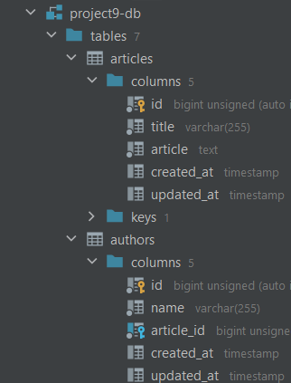
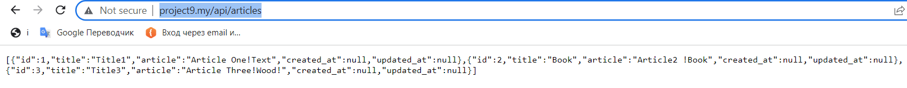
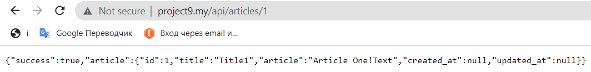
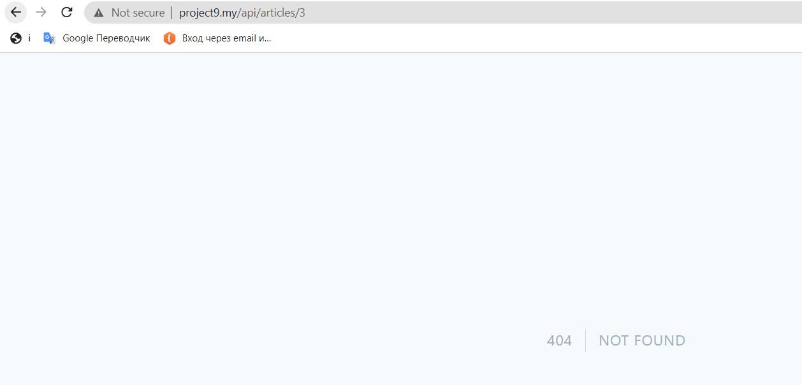
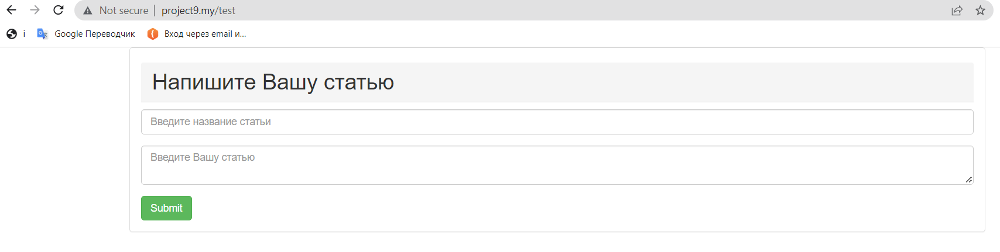
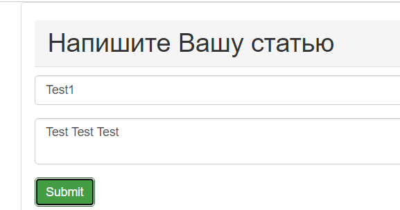
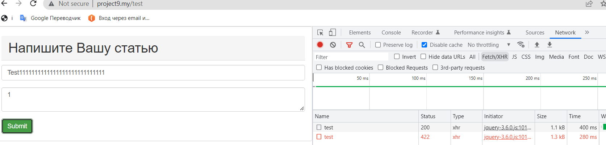
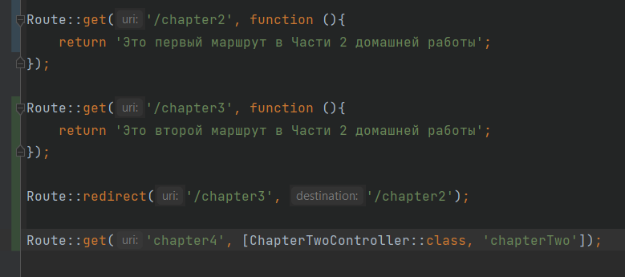

## Домашнее заданее № 10.

Часть 1:

- Проект создан на Laravel Framework 9.17.0.
- Создана база данных MySQL (имя базы данных: project9-db).
- В файл .env внесены необходимые настройки для базы данных.
- Созданы 2 таблицы в базе данных:
  
- Создаем модели с миграцией и фабрикой командой php artisan make:model Articles -mf и Authors
- Затем в папке database/migrations появятся файлы миграций бд в которых мы создам поля таблицы БД ()Schema::create.
- Далее командой php artisan migrate мы добавляем наши таблицы по схемам миграций в БД.
- Теперь необходимо создать API которая будет работать с данными из БД.
- В папке Http/Controllers/ создаем папку api и в ней создаем наш контролле для работы со статьями ArticleController.
- В нем на данный момент есть 2 метода показать все статьи (viewAll) и показать статью по id (viewOne).
- Теперь создаем маршруты, папка routes -> файл api.php тут прописываем наши маршруты
- Первый маршрут выводит все записи при обращении к методу контроллера
- Второй выводит определенную статью по ее id, попробывал сделать ограничение на вывод только первой и второй статьи при помощии where

Выводим одну статью:

Пытаемся получить 3ю статью:

- 🛑 На данный момент все маршруты общедоступные!не смог разобраться как сделать защищенный ресурс при помощи get-параметра из URL!!!!
- Создана форма для отправки статей (содержит 2 поля, название и сама статья) URL http://project9.my/test

- В форме сделана проверка (тестово) на длинну строки в названии статьи нельзя вносить больше 11 символов а в самой статье от 3х символом должно быть.
- 🛑 не смог сделать отправку данных из формы в БД при помощи Ajax (В БД приходит пустые значения)

В БД:

- В документации по Laravel я нашел следующее:Однако многие приложения используют AJAX-запросы. При использовании validate метода во время запроса AJAX Laravel не будет генерировать ответ перенаправления. Вместо этого Laravel генерирует ответ JSON, содержащий все ошибки проверки. Этот ответ JSON будет отправлен с кодом состояния 422 HTTP.
- Все что выяснил на данный момент что, Валидация работает так как приходит код 422 HTTP.

- на данный момент это все по первой части домашней работы.

- Вторая часть домашней работы
- Создан маршрут в web 
- создан Редирект со второго маршрута на первый
- Логика вынесена в контроллер

- 🛑 пока разбираюсь с последней задачей!

# Домашнее задание 10.

# Часть 1.

#### 1. Подробнее познакомьтесь с созданием API. Попробуйте создать простое API c общедоступными и защищенными маршрутами.

#### 2. Создайте форму, при отправке которой при помощи посредника будет выполняться проверка на пустоту одного из значений. Если значение пустое должен выполняться редиректна страницу с формой. Иначе, все значения из формы должны выводиться на новой странице. Используйте контроллеры для логики маршрутов..

#### 3. При редиректена страницу с формой должна отображаться ошибка с указанием незаполненного поля.

# Часть 2.

#### 1. Создайте маршрут для GET-запроса и выведите какую-либо информацию.

#### 2. Создайте маршрут, при обращении к которому выполнится редиректна первый маршрут.

#### 3. Создайте контроллер и перенесите логику из первого маршрута в этот контроллер. Также выведите URL этого маршрута.

#### 4. Создайте третий маршрут, который будет принимать параметр, и создайте четвертый маршрут. Создайте посредника и назначьте его для всех четырех маршрутов. Если идет обращение к четвертому маршруту, в посреднике выполните редирект на третий маршрут, передав параметр. Выведите значение этого параметра.

 
